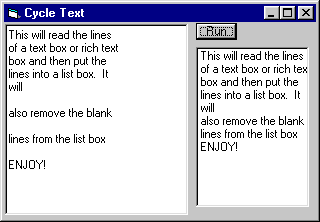

<div align="center">

## Line by Line Text Cycle


</div>

### Description

This code will cycle through a text box or rich text box line by line, select the line and place it into a string array. The array will then be passed to another method where it will be placed into a list box excluding the blank lines.

I've seen other code like this but if there is no ending vbCrLf then the last line of the box is not read, I've fixed this and showed how to extract the line information and how to use it.

The code is slowed down using a pause routine that I made about a year ago.
 
### More Info
 
Assumption is that this code is for beginners to experts


<span>             |<span>
---                |---
**Submitted On**   |
**By**             |[rbennett](https://github.com/Planet-Source-Code/PSCIndex/blob/master/ByAuthor/rbennett.md)
**Level**          |Beginner
**User Rating**    |4.5 (18 globes from 4 users)
**Compatibility**  |VB 5\.0, VB 6\.0
**Category**       |[String Manipulation](https://github.com/Planet-Source-Code/PSCIndex/blob/master/ByCategory/string-manipulation__1-5.md)
**World**          |[Visual Basic](https://github.com/Planet-Source-Code/PSCIndex/blob/master/ByWorld/visual-basic.md)
**Archive File**   |[](https://github.com/Planet-Source-Code/rbennett-line-by-line-text-cycle__1-11756/archive/master.zip)


### Source Code

```
Private Sub Command1_Click()
 Call CycleText
End Sub
Sub CycleText()
 Dim curPos As Integer, lineStart As Integer, n As Integer
 Dim finis As Boolean, breakLoop As Boolean, i As Integer
 Dim strArray() As String
 lineStart = 1
 curPos = 1
 n = 0
 finis = False
 breakLoop = False
 Do Until breakLoop
  curPos = InStr(lineStart, Form1.RichTextBox1.Text, vbCrLf, vbBinaryCompare)
  Form1.RichTextBox1.SelStart = lineStart - 1
  If curPos > 1 Then
   Form1.RichTextBox1.SelLength = curPos - lineStart
  Else
   Form1.RichTextBox1.SelLength = (Len(Form1.RichTextBox1.Text) + 1) - lineStart
   finis = True
  End If
  ReDim Preserve strArray(n) As String
  strArray(n) = Form1.RichTextBox1.SelText
  TimedPause 1
  If finis Then breakLoop = True
  n = n + 1
  lineStart = curPos + 2
  curPos = 1
  DoEvents
 Loop
 Call PutInListBox(strArray(), n - 1)
End Sub
Sub PutInListBox(myArray, totalArray As Integer)
 Dim i As Integer, listCount As Integer
 listCount = 0
 For i = 0 To totalArray
  If Len(myArray(i)) Then
   List1.AddItem myArray(i), listCount
   listCount = listCount + 1
  End If
 Next i
End Sub
Function TimedPause(secs As Long)
 Dim secStart As Variant
 Dim secNow As Variant
 Dim secDiff As Variant
 secStart = Format(Now(), "mm/dd/yyyy hh:nn:ss AM/PM")
 Do While secDiff < secs
   secNow = Format(Now(), "mm/dd/yyyy hh:nn:ss AM/PM")
   secDiff = DateDiff("s", secStart, secNow)
 Loop
End Function
```

